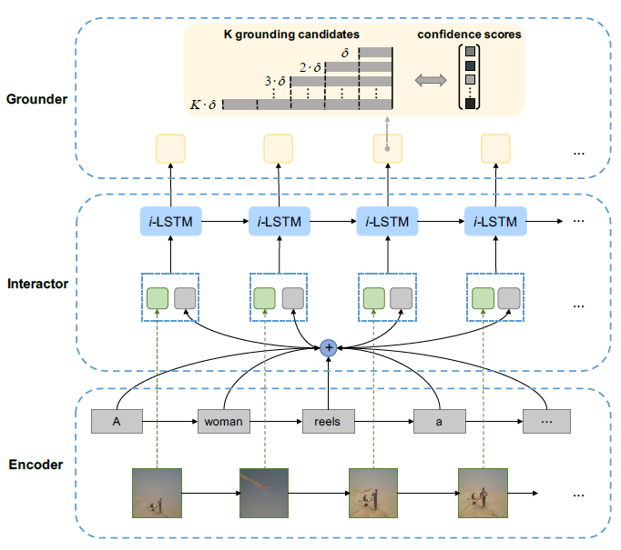

# TGN
Tensorflow Implementation of the EMNLP-2018 paper [Temporally Grounding Natural Sentence in Video](https://pdfs.semanticscholar.org/452a/ca244ef62a533d8b46a54c6212fe9fa3ce9a.pdf) by Jingyuan Chen *et al.*



### Requirements
``` bash
pip install -r requirements.txt
```

### Data Preparation
1. Download Glove word embedding data.
``` shell
cd download/
sh download_glove.sh
```

2. Download dataset features.
``` shell
cd datasets/tacos/features/
sh download_features.sh
cd datasets/charades/features/
sh download_features.sh
cd datastes/activitynet_captions/features/
sh download_features.sh
```

3. Download trained models.
[TACoS]()
[Charades-STA]()
[ActivityNet-Captions]()
Put them in the corresponding `./checkpoints/{DATASET}/` .

4. Data Preprocessing (Optional)
``` shell
cd datasets/tacos/
sh prepare_data.sh
```
Then copy the generated data in `./data/save/` .
Use correspondig scripts for preparing data for other datasets.
You may skip this procedure as the prepared data is already saved in `./datasets/{DATASET}/data/save/` .

### Testing and Evaluation

``` shell
sh scripts/test_tacos.sh
sh scripts/eval_tacos.sh
```
Use corresponding scripts for testing or evaluating for other datasets.
The predicted results are also provided in `./results/{DATASET}/` .

### Training

``` shell
sh scripts/train_tacos.sh
```
Use corresponding scripts for training for other datasets.